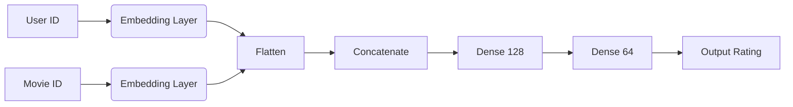

# 🧠 Laporan Proyek Machine Learning - Andri Martin

## 📌 Project Overview

Sistem rekomendasi telah menjadi komponen penting dalam industri digital, terutama dalam platform streaming film seperti Netflix, Disney+, dan lainnya. Proyek ini bertujuan untuk mengembangkan sistem rekomendasi film berbasis *Collaborative Filtering* dan *Deep Learning* menggunakan dataset **MovieLens Small Latest**.

Permasalahan yang diselesaikan adalah bagaimana memberikan rekomendasi film yang akurat kepada pengguna berdasarkan interaksi rating pengguna sebelumnya terhadap film.

Referensi terkait:
- [MovieLens Dataset - GroupLens Research](https://grouplens.org/datasets/movielens/)
- Y. Koren, R. Bell, and C. Volinsky, “Matrix factorization techniques for recommender systems,” IEEE Computer, 2009.

---

## 🎯 Business Understanding

### 🔍 Problem Statements
- Bagaimana memberikan rekomendasi film yang relevan berdasarkan film yang disukai pengguna?
- Bagaimana memprediksi rating yang akan diberikan oleh pengguna terhadap film yang belum pernah mereka tonton?

### 🎯 Goals (Tujuan)
- Membangun sistem **item-based Collaborative Filtering** menggunakan algoritma **K-Nearest Neighbors (KNN)** dengan metrik **cosine similarity** untuk merekomendasikan film yang mirip berdasarkan pola rating pengguna.
- Membangun model **Deep Learning berbasis embedding** untuk **memprediksi rating** antara pengguna dan film, termasuk untuk pasangan yang belum pernah muncul (*user–item pairs* baru).

### 💡 Solution Statements (Pernyataan Solusi)
#### 🔹 Pendekatan 1: Collaborative Filtering (KNN)
- Menggunakan algoritma **K-Nearest Neighbors** dari `sklearn.neighbors.NearestNeighbors` dengan **cosine similarity** untuk menghitung kemiripan antar item (film).
- Metode ini cocok untuk **item-to-item recommendation**, cepat dalam pelatihan dan inferensi, serta mudah diinterpretasikan.
#### 🔹 Pendekatan 2: Deep Learning Embedding
- Mengembangkan model **neural network sederhana** yang terdiri dari dua **embedding layer** untuk merepresentasikan **user** dan **movie** dalam bentuk vektor laten.
- Model ini memanfaatkan kemampuan **Deep Learning** untuk **menangkap hubungan kompleks dan non-linear**, memungkinkan prediksi rating bahkan untuk pasangan *user–movie* yang belum pernah muncul.
- Walaupun memerlukan **komputasi lebih besar** dan **waktu pelatihan lebih lama**, pendekatan ini cocok untuk **sistem berskala besar** dan dapat menjadi pondasi untuk **sistem rekomendasi hybrid** di masa depan.

### ⚖️ Kelebihan & Kekurangan Pendekatan

#### 🔹 KNN Collaborative Filtering:
- ✅ **Kelebihan**:
  - Mudah diimplementasikan
  - Interpretasi hasil yang intuitif
  - Cocok untuk dataset kecil–menengah
- ❌ **Kekurangan**:
  - Tidak cocok untuk data sangat besar (tidak skalabel)
  - Masalah *cold start* (user/film baru)
  - Butuh sparsity handling

#### 🔹 Deep Learning Embedding:
- ✅ **Kelebihan**:
  - Menangkap relasi non-linear dan kompleks
  - Lebih akurat pada skala besar
  - Bisa dikembangkan ke model *hybrid*
- ❌ **Kekurangan**:
  - Membutuhkan resource lebih tinggi
  - Interpretasi hasil lebih sulit
  - Waktu pelatihan relatif lama

---

## 📊 Data Understanding

📂 **Dataset**:  
Dataset yang digunakan dalam proyek ini adalah **MovieLens Latest Small Dataset** yang tersedia secara publik melalui Kaggle:

➡️ [MovieLens Dataset - Kaggle (Shubham Mehta)](https://www.kaggle.com/datasets/shubhammehta21/movie-lens-small-latest-dataset)

Dataset yang digunakan berasal dari **MovieLens Small Latest Dataset** dengan dua file utama:

- `movies.csv`: Informasi `movieId`, `title`, dan `genres`.
- `ratings.csv`: Informasi `userId`, `movieId`, `rating`, dan `timestamp`.

| Dataset  | Jumlah Baris |
|----------|---------------|
| movies   | 9.742         |
| ratings  | 100.836       |

Distribusi rating berada di kisaran 3.0–4.0. Beberapa visualisasi awal meliputi:
- Histogram distribusi rating
- Boxplot distribusi rating
- Barplot 10 film dengan jumlah rating terbanyak

---

## 🧹 Data Preparation

Langkah-langkah preprocessing yang dilakukan meliputi beberapa tahapan penting untuk memastikan data siap digunakan dalam model Collaborative Filtering dan Deep Learning:

### 1. Pivot Table (User-Item Matrix)
- Mengubah data ke dalam bentuk matriks pivot dengan format (`movieId` x `userId`)
- Nilai isi matriks diisi oleh **rating** yang diberikan user ke film
```python
data = pd.pivot_table(ratings, index='movieId', columns='userId', values='rating')
```

### 2. Handling Missing Values
- Mengisi nilai kosong dalam matriks pivot dengan **0**, menandakan **tidak ada interaksi** antara user dan item

### 3. Filtering Data
- Hanya menyertakan **film** yang memiliki lebih dari **10 rating**
- Hanya menyertakan **pengguna** dengan lebih dari **60 interaksi (rating)**
- Tujuannya adalah untuk mengurangi **noise** dan meningkatkan kualitas data interaksi yang digunakan model

### 4. Sparse Matrix Transformation
- Mengubah matriks menjadi bentuk **Compressed Sparse Row (CSR)** menggunakan `scipy.sparse`
- Hal ini penting untuk **efisiensi memori** dan **kecepatan komputasi** saat digunakan dalam algoritma KNN
Contoh kode snippet:
```python
from scipy.sparse import csr_matrix

rating_matrix = pivot_table.fillna(0)
csr_data = csr_matrix(rating_matrix.values)
```

### 5. TF-IDF Vectorization (Fallback Recommendation)
- Membuat representasi **TF-IDF** dari **judul film**
- Digunakan sebagai **fallback recommendation** ketika **film input tidak ditemukan** dalam dataset Collaborative Filtering berbasis KNN

### 6. Encoding untuk Model Deep Learning
- Melakukan mapping `userId` dan `movieId` ke dalam **representasi numerik berurutan** menggunakan `LabelEncoder`
- Membuat dictionary seperti:
  - `user2user_encoded`
  - `movie2movie_encoded`
  - `user_encoded2user`
  - `movie_encoded2movie`
- Dictionary ini digunakan kembali dalam proses **prediksi**, **pelatihan**, dan **interpretasi hasil**

### 7. Train-Test Split
- Membagi dataset menjadi:
  - **80% data training**
  - **20% data testing**
- Pembagian ini digunakan untuk **melatih** dan **mengevaluasi** model rekomendasi berbasis **Deep Learning (Embedding-based)**

---
# 🤖 Modeling dan Evaluasi Sistem Rekomendasi Film

## 1️⃣ Collaborative Filtering (Item-to-Item KNN)

**Metode:**  
Menggunakan K-Nearest Neighbors (KNN) dengan **cosine similarity** untuk menemukan film yang mirip berdasarkan pola rating pengguna.

**Input:**  
Judul film

**Output:**  
10 film paling mirip berdasarkan kesamaan pola rating.

**Contoh Kode:**
```python
from sklearn.neighbors import NearestNeighbors

knn = NearestNeighbors(metric='cosine', algorithm='brute')
knn.fit(csr_data)  # csr_data adalah matriks user-item dalam bentuk sparse
```

## Contoh Output - KNN (Collaborative Filtering)

Input: `Captain America: The Winter Soldier`

| Title                          | Avg. Rating | Cosine Distance |
|--------------------------------|-------------|-----------------|
| Avengers: Age of Ultron (2015)  | 3.52        | 0.18            |
| Iron Man 3 (2013)               | 3.56        | 0.28            |
| Captain America: Civil War (2016)| 3.61      | 0.29            |
| Thor: The Dark World (2013)     | 3.31        | 0.31            |
| Star Trek Into Darkness (2013) | 3.69        | 0.33            |
| X-Men: Days of Future Past (2014)| 3.83      | 0.34            |
| Avengers, The (2012)            | 3.87        | 0.34            |
| Guardians of the Galaxy (2014)  | 4.05        | 0.35            |
| Iron Man 2 (2010)               | 3.51        | 0.37            |
| Ant-Man (2015)                  | 3.72        | 0.38            |

---

## 2️⃣ Deep Learning (Embedding-based)

### Tujuan:
Memprediksi rating yang mungkin diberikan user terhadap film tertentu.

### Input:
- ID user
- ID film

### Arsitektur Model:
- Dua layer embedding (user & movie)
- Concatenate
- Dense Layer
- Output rating (regresi)



### Parameter:
- **Embedding size**: `50`
- **Optimizer**: `Adam`
- **Loss**: `Mean Squared Error (MSE)`
- **Metrics**: `Mean Absolute Error (MAE)`

### Contoh Kode Arsitektur:

```python
from tensorflow.keras.layers import Input, Embedding, Flatten, Concatenate, Dense
from tensorflow.keras.models import Model

user_input = Input(shape=(1,))
movie_input = Input(shape=(1,))
user_emb = Embedding(num_users, 50)(user_input)
movie_emb = Embedding(num_movies, 50)(movie_input)

x = Concatenate()([Flatten()(user_emb), Flatten()(movie_emb)])
x = Dense(128, activation='relu')(x)
output = Dense(1)(x)

model = Model([user_input, movie_input], output)
model.compile(optimizer='adam', loss='mse', metrics=['mae'])
```

### Contoh Hasil Rekomendasi (Top-10 untuk user ID 3)
```python
print("Deep Learning Recommendations for User ID 3:")
dl_recommendations = recommend_movies_for_user(user_id=3, num_recommendations=10)
display(dl_recommendations)
```

| Rank | Movie ID | Judul Film                                | Predicted Rating |
| ---- | -------- | ----------------------------------------- | ---------------- |
| 1    | 2360     | Celebration, The (Festen) (1998)          | 4.2416           |
| 2    | 3531     | All the Vermeers in New York (1990)       | 4.0417           |
| 3    | 5915     | Victory (a.k.a. Escape to Victory) (1981) | 4.0225           |
| 4    | 6835     | Alien Contamination (1980)                | 3.9989           |
| 5    | 7614     | Oklahoma! (1955)                          | 3.9864           |
| 6    | 25947    | Unfaithfully Yours (1948)                 | 3.9770           |
| 7    | 26810    | Bad Boy Bubby (1993)                      | 3.9765           |
| 8    | 72692    | Mickey's Once Upon a Christmas (1999)     | 3.9754           |
| 9    | 87234    | Submarine (2010)                          | 3.9743           |
| 10   | 106642   | Day of the Doctor, The (2013)             | 3.9608           |

---

## 📈 Evaluation

### KNN (Collaborative Filtering)
- **Evaluasi Kualitatif**: Hasil rekomendasi dianalisis secara subjektif berdasarkan relevansi dan kesesuaian genre dengan preferensi pengguna.
- **Evaluasi Kuantitatif**: Menggunakan metrik Precision@10 dan Recall@10 untuk lima pengguna sampel (User ID: 1, 15, 30, 45, 60).

| User ID | Jumlah High-Rated Movies | Precision@10 | Recall@10 |
|---------|---------------------------|--------------|-----------|
| 1       | 200                       | 0.60         | 0.03      |
| 15      | 56                        | 0.30         | 0.05      |
| 30      | 31                        | 0.20         | 0.06      |
| 45      | 270                       | 0.80         | 0.03      |
| 60      | 13                        | 0.10         | 0.08      |

**Rata-rata Precision@10**: 0.40  
**Rata-rata Recall@10**: 0.05  

> *Interpretasi*: Model KNN cenderung memberikan rekomendasi yang relevan (Precision cukup tinggi), namun cakupannya masih terbatas (Recall rendah).

---

### Deep Learning (Embedding-based)
- **Evaluasi**: Menggunakan metrik regresi standar pada data uji (test set).
- **Metode**: Perhitungan MSE dan MAE langsung dari prediksi model dan dibandingkan ulang untuk konsistensi.

### 📊 Hasil Evaluasi Model Deep Learning (Embedding Based)

| Metrik | Skor   |
|--------|--------|
| MAE    | 0.6702 |
| MSE    | 0.7672 |
| RMSE   | 0.8759 |

**Penjelasan:**
- **MAE (Mean Absolute Error)**: Rata-rata selisih absolut antara rating yang diprediksi dan aktual.
- **MSE (Mean Squared Error)**: Rata-rata kuadrat dari selisih prediksi dan aktual.
- **RMSE (Root Mean Squared Error)**: Akar dari MSE, menunjukkan seberapa besar deviasi prediksi terhadap nilai sebenarnya.

> *Kesimpulan*: Model deep learning menunjukkan performa yang stabil dan cukup baik dalam mempelajari pola interaksi pengguna dan film, dengan error prediksi yang rendah.

---

## ✅ Kesimpulan

- Sistem rekomendasi berbasis **Collaborative Filtering (KNN)** berhasil dibangun dan menunjukkan performa baik dalam memberikan rekomendasi film yang **mirip** berdasarkan pola rating pengguna. Metode ini cocok digunakan dalam skenario *item-to-item recommendation*, mudah diinterpretasikan, dan cepat di-*deploy*.

- Pendekatan berbasis **Deep Learning dengan embedding layer** memperluas kemampuan sistem untuk **memprediksi rating**, bahkan terhadap kombinasi *user–movie* yang belum pernah muncul sebelumnya. Model ini menunjukkan fleksibilitas tinggi dan mampu menangkap **hubungan laten antar pengguna dan film**, sehingga cocok untuk sistem skala besar.

- Kelemahan dari Collaborative Filtering terletak pada **cold-start problem**, sedangkan model Deep Learning membutuhkan **sumber daya komputasi lebih besar** dan proses training yang lebih kompleks.

- Secara umum, kedua pendekatan saling melengkapi dan sangat potensial jika digabungkan menjadi **Hybrid Recommendation System** agar sistem dapat memberikan rekomendasi yang lebih **akurat, personal**, dan **tahan terhadap masalah cold-start**.
