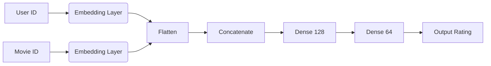

# 🧠 Laporan Proyek Machine Learning - Andri Martin

## 📌 Project Overview

Sistem rekomendasi telah menjadi komponen penting dalam industri digital, terutama dalam platform streaming film seperti Netflix, Disney+, dan lainnya. Proyek ini bertujuan untuk mengembangkan sistem rekomendasi film berbasis *Collaborative Filtering* dan *Deep Learning* menggunakan dataset **MovieLens Small Latest**.

Permasalahan yang diselesaikan adalah bagaimana memberikan rekomendasi film yang akurat kepada pengguna berdasarkan interaksi rating pengguna sebelumnya terhadap film.

Referensi terkait:
- [MovieLens Dataset - GroupLens Research](https://grouplens.org/datasets/movielens/)
- Y. Koren, R. Bell, and C. Volinsky, “Matrix factorization techniques for recommender systems,” IEEE Computer, 2009.

---

## 🎯 Business Understanding

### 🔍 Problem Statements
- Bagaimana memberikan rekomendasi film yang relevan berdasarkan film yang disukai pengguna?
- Bagaimana memprediksi rating yang akan diberikan oleh pengguna terhadap film yang belum pernah mereka tonton?

### 🎯 Goals
- Membangun sistem *Collaborative Filtering* berbasis item menggunakan KNN dan cosine similarity.
- Membangun model Deep Learning berbasis embedding untuk prediksi rating pengguna terhadap film tertentu.

### 💡 Solution Statements
- **Pendekatan 1**: Menggunakan **KNN** dengan cosine similarity untuk menghitung kemiripan antar film berdasarkan pola rating pengguna.
- **Pendekatan 2**: Membangun model **Deep Learning** dengan dua embedding layer untuk mempelajari representasi laten pengguna dan film.

### ⚖️ Kelebihan & Kekurangan Pendekatan

#### 🔹 KNN Collaborative Filtering:
- ✅ **Kelebihan**:
  - Mudah diimplementasikan
  - Interpretasi hasil yang intuitif
  - Cocok untuk dataset kecil–menengah
- ❌ **Kekurangan**:
  - Tidak cocok untuk data sangat besar (tidak skalabel)
  - Masalah *cold start* (user/film baru)
  - Butuh sparsity handling

#### 🔹 Deep Learning Embedding:
- ✅ **Kelebihan**:
  - Menangkap relasi non-linear dan kompleks
  - Lebih akurat pada skala besar
  - Bisa dikembangkan ke model *hybrid*
- ❌ **Kekurangan**:
  - Membutuhkan resource lebih tinggi
  - Interpretasi hasil lebih sulit
  - Waktu pelatihan relatif lama

---

## 📊 Data Understanding

📂 **Dataset**:  
Dataset yang digunakan dalam proyek ini adalah **MovieLens Latest Small Dataset** yang tersedia secara publik melalui Kaggle:

➡️ [MovieLens Dataset - Kaggle (Shubham Mehta)](https://www.kaggle.com/datasets/shubhammehta21/movie-lens-small-latest-dataset)

Dataset yang digunakan berasal dari **MovieLens Small Latest Dataset** dengan dua file utama:

- `movies.csv`: Informasi `movieId`, `title`, dan `genres`.
- `ratings.csv`: Informasi `userId`, `movieId`, `rating`, dan `timestamp`.

| Dataset  | Jumlah Baris |
|----------|---------------|
| movies   | 9.742         |
| ratings  | 100.836       |

Distribusi rating berada di kisaran 3.0–4.0. Beberapa visualisasi awal meliputi:
- Histogram distribusi rating
- Boxplot distribusi rating
- Barplot 10 film dengan jumlah rating terbanyak

---

## 🧹 Data Preparation

Langkah-langkah preprocessing yang dilakukan:
- Filtering data: Hanya menyertakan film dengan >10 rating dan user dengan >60 interaksi.
- Mengubah data ke dalam bentuk matrix pivot (`movieId` x `userId`) dengan rating sebagai isi.
- Mengisi nilai kosong dengan 0.
- Menggunakan **Compressed Sparse Row Matrix (CSR)** untuk efisiensi memori dan komputasi.

Contoh kode snippet:
```python
from scipy.sparse import csr_matrix

rating_matrix = pivot_table.fillna(0)
csr_data = csr_matrix(rating_matrix.values)
```

# 🤖 Modeling dan Evaluasi Sistem Rekomendasi Film

## 1️⃣ Collaborative Filtering (Item-to-Item KNN)

**Metode:**  
Menggunakan K-Nearest Neighbors (KNN) dengan **cosine similarity** untuk menemukan film yang mirip berdasarkan pola rating pengguna.

**Input:**  
Judul film

**Output:**  
10 film paling mirip berdasarkan kesamaan pola rating.

**Contoh Kode:**
```python
from sklearn.neighbors import NearestNeighbors

knn = NearestNeighbors(metric='cosine', algorithm='brute')
knn.fit(csr_data)  # csr_data adalah matriks user-item dalam bentuk sparse
```

## Contoh Output - KNN (Collaborative Filtering)

Input: `Captain America: The Winter Soldier`

| Title                          | Avg. Rating | Cosine Distance |
|--------------------------------|-------------|-----------------|
| Avengers: Age of Ultron (2015)  | 3.52        | 0.18            |
| Iron Man 3 (2013)               | 3.56        | 0.28            |
| Captain America: Civil War (2016)| 3.61      | 0.29            |
| Thor: The Dark World (2013)     | 3.31        | 0.31            |
| Star Trek Into Darkness (2013) | 3.69        | 0.33            |
| X-Men: Days of Future Past (2014)| 3.83      | 0.34            |
| Avengers, The (2012)            | 3.87        | 0.34            |
| Guardians of the Galaxy (2014)  | 4.05        | 0.35            |
| Iron Man 2 (2010)               | 3.51        | 0.37            |
| Ant-Man (2015)                  | 3.72        | 0.38            |

---

## 2️⃣ Deep Learning (Embedding-based)

### Tujuan:
Memprediksi rating yang mungkin diberikan user terhadap film tertentu.

### Input:
- ID user
- ID film

### Arsitektur Model:
- Dua layer embedding (user & movie)
- Concatenate
- Dense Layer
- Output rating (regresi)
**Arsitektur Model**:



### Parameter:
- **Embedding size**: `50`
- **Optimizer**: `Adam`
- **Loss**: `Mean Squared Error (MSE)`
- **Metrics**: `Mean Absolute Error (MAE)`

### Contoh Kode Arsitektur:

```python
from tensorflow.keras.layers import Input, Embedding, Flatten, Concatenate, Dense
from tensorflow.keras.models import Model

user_input = Input(shape=(1,))
movie_input = Input(shape=(1,))
user_emb = Embedding(num_users, 50)(user_input)
movie_emb = Embedding(num_movies, 50)(movie_input)

x = Concatenate()([Flatten()(user_emb), Flatten()(movie_emb)])
x = Dense(128, activation='relu')(x)
output = Dense(1)(x)

model = Model([user_input, movie_input], output)
model.compile(optimizer='adam', loss='mse', metrics=['mae'])
```

## 📈 Evaluation

### KNN (Collaborative Filtering)
- **Evaluasi**: Berdasarkan relevansi hasil rekomendasi.
- **Validasi**: Secara kualitatif dengan melihat kemiripan konten film yang direkomendasikan.

### Deep Learning (Embedding-based)
- **Evaluasi**: Berdasarkan metrik regresi.
- **Data**: Menggunakan data test.

### 📈 Hasil Evaluasi Model Deep Learning (Embedding Based)

| Metrik | Skor   |
|--------|--------|
| MAE    | 0.6792 |
| MSE    | 0.8147 |

**Penjelasan:**
- **MAE (Mean Absolute Error)**: Rata-rata selisih absolut antara rating yang diprediksi dan aktual.
- **MSE (Mean Squared Error)**: Rata-rata kuadrat dari selisih antara prediksi dan aktual.

Model ini menunjukkan performa yang cukup baik dalam memprediksi rating pengguna terhadap film. Nilai MAE dan MSE yang relatif rendah menunjukkan bahwa model mampu mempelajari pola interaksi pengguna dan film secara efektif

---

## ✅ Kesimpulan
- **Collaborative Filtering** berbasis KNN cocok untuk memberikan rekomendasi film serupa, mudah diinterpretasikan, dan efektif.
- **Deep Learning** dengan embedding mampu menangkap relasi kompleks antar pengguna dan film, serta memprediksi rating dengan cukup akurat.
- Kedua pendekatan dapat digabungkan menjadi **Hybrid Recommendation System** untuk hasil yang lebih optimal.
